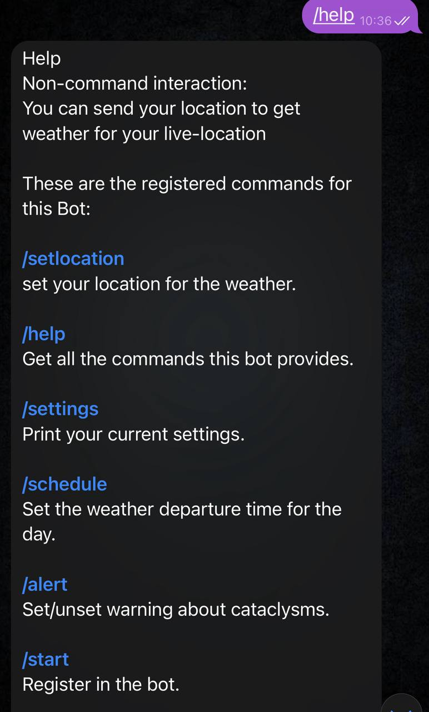
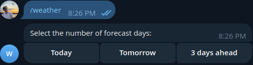
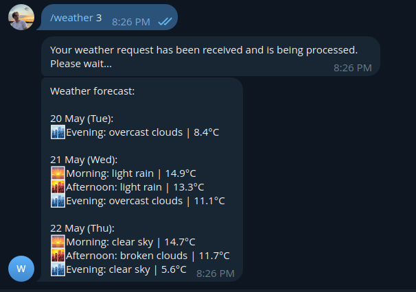
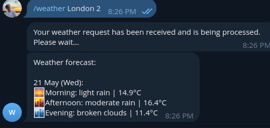
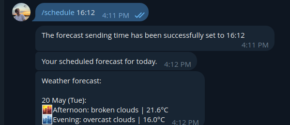
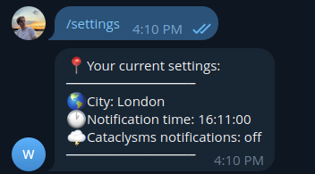
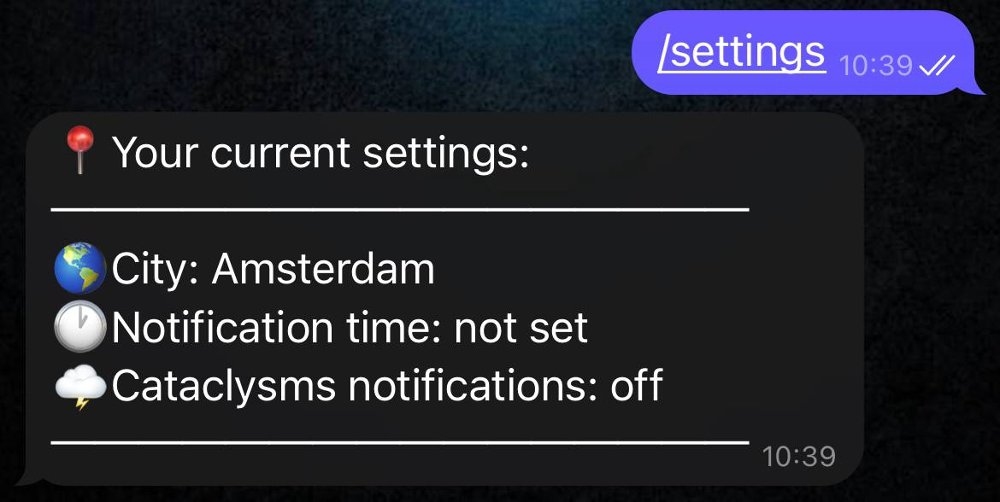
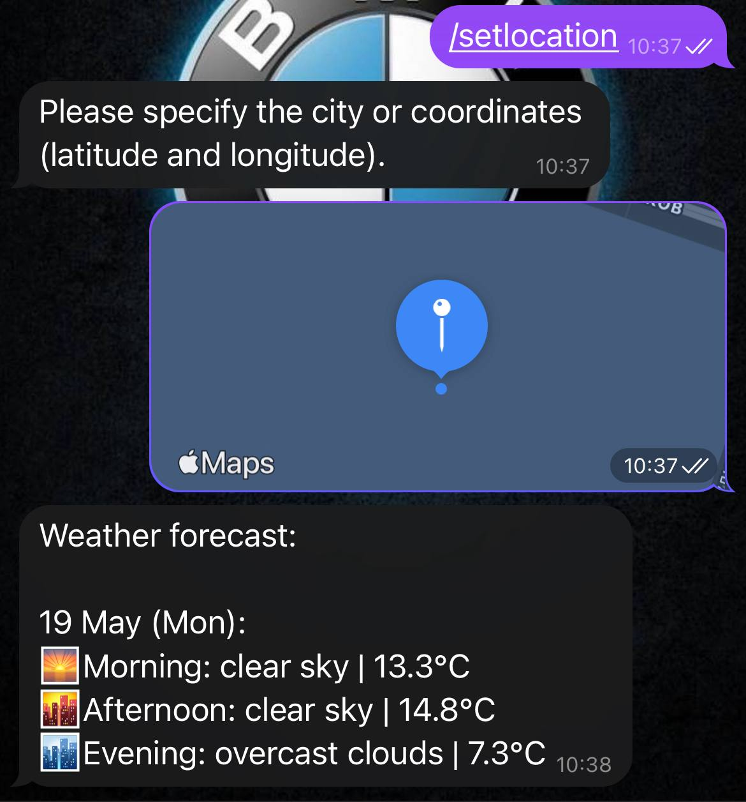

# 🌤️Weather-Bot

Link to the bot:
[](https://t.me/weather_java25_bot)

## 📋Dependencies
 - **Spring Framework** (REST, JDBC, REST Docs)
 - **PostgreSQL**
 - **Zookeeper**
 - **Kafka**
 - **Docker**
 - **Maven 3.9+**
 - **JDK 21+**

### 💡Features
1. **Sign up** — register a new account/log in to an existing one with the `/start` command.
2. **Help** — output of all available bot commands with the command `/help'.
3. **Set location**
   - `/setlocation <city_name>`
   - `/setlocation <lat> <lon>`
4. **Weather forecast**
   - `/weather` — buttons «Today / Tomorrow / 3 days ahead»
   - `/weather <n>` — forecast for *n* days (1-3) from the saved location
   - `/weather <city_name>` — forecast for any city
5. **Daily scheduler**
   - `/schedule HH:mm` — set the time for the daily forecast
   - The background scheduler sends out a forecast at a given time.
6. **Settings** — `/settings` displays the current parameters (city/coordinates, time, cataclysm-alerts).
7. **Inline UI** — convenient inline buttons for selecting the number of days and the city.
8. **Robust error-handling** — validation of coordinates, time, and unknown commands.

---

## 🚀Deploy

### Local Deploy

```bash
git clone github.com/artemis43rd/Weather-Bot/
cd Weather-bot/weather-bot

# input src/main/resources/{bot,database}.properties:

mvn clean package
java -jar target/weather-bot-1.0-SNAPSHOT-jar-with-dependencies.jar
```

### Docker
Link to bot Docker image:
[](https://hub.docker.com/r/artemis43rd/weather-bot)

To use it, specify services.app.image: artemis43rd/weather-bot in docker-compose.yml instead of services.bot.build.
```bash
mvn package
docker compose build
 # requires 'db', 'zookeeper' and 'kafka' to run.
docker compose up
```

## Администрирование
### Проверка состояния
```bash
curl http://localhost:8081/healthcheck
```

### Список пользователей (админ)
```bash
curl 'http://localhost:8081/admin/users' -i -u 'admin:admin'
```

## 🎯 Commands and using example

---

### Command `/start`
- **New user** → «Welcome to Weather Bot! You have been registered as: `[username]`.»
- **Registered** → «Welcome back, `[username]`! You are already registered».


---

### Command `/help`


---

### Command `/setlocation`

####  City
```bash
/setlocation <city_name>
```


####  Coordinates
```bash
/setlocation <lat> <lon>
```


---

### Command `/weather`
#### Without arguments
The inline keyboard for selecting the forecast day will appear.



#### With arguments
```bash
/weather 3          # 3 days for the saved location
/weather London 2   # London, tomorrow
```



---

### Command `/schedule` (Reminder)
```bash
/schedule HH:mm
```


---

### Command `/settings`
```bash
/settings
```



---

### Message without a command
### Any text


### Geoposition
In this case, the weather forecast for the coordinates is displayed, but they are not saved to the profile.
(Do need to save?)
