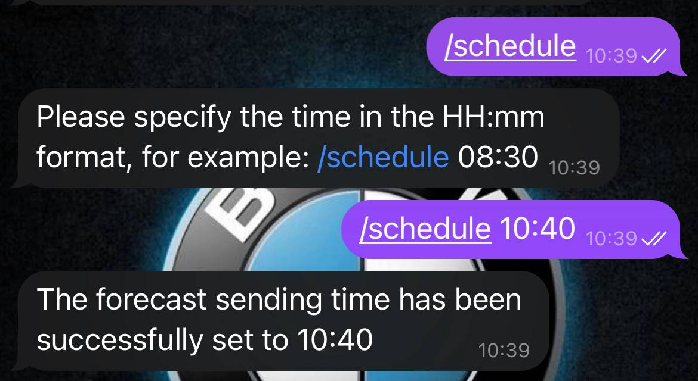

# 🌤️Weather-Bot

[](https://t.me/weather_java25_bot)

## 📋Dependencies
 - **TelegramBots Java**  
 - **Spring Framework** (Context, JDBC, Scheduling)  
 - **Jackson** (JSON ↔ POJOs)  
 - **Apache DBCP2** (connection pool)  
 - **PostgreSQL**  
 - **Maven 3.9+ / JDK 21+**

### 💡Common features:
 - Напишите **/help** боту в Telegram, чтобы увидеть все команды.

### 💡Features
1. **Sign up** — регистрация новой учётки командой `/start`.  
2. **Set location**  
   - `/setlocation <город>`  
   - `/setlocation <lat> <lon>`  
   - отправка геолокации сообщением.  
3. **Weather forecast**  
   - `/weather` — клавиатура «Today / Tomorrow / 3 days ahead»  
   - `/weather <n>` — прогноз на *n* дней (1–3) из сохранённой локации  
   - `/weather <город> [n]` — прогноз для произвольного города  
4. **Daily scheduler**  
   - `/schedule HH:mm` — установить время ежедневной рассылки  
   - Фоновый планировщик рассылает прогноз в заданный час.  
5. **Settings** — `/settings` выводит текущие параметры (город/координаты, время, cataclysm-alerts).  
6. **Inline UI** — удобные inline-кнопки для выбора количества дней и города.  
7. **Robust error-handling** — валидация координат, времени, неизвестных команд.

---

## 🚀Deploy

### Локальный запуск

```bash
git clone github.com/artemis43rd/Weather-Bot/
cd Weather-bot

# заполните src/main/resources/{bot,database}.properties:
# token=<TELEGRAM_BOT_TOKEN>
# api-key=<OPENWEATHER_API_KEY>
# db.url=jdbc:postgresql://localhost:5432/weather_bot
# ...

mvn clean package
java -jar target/weather-bot-1.0-SNAPSHOT-jar-with-dependencies.jar
```
### Docker
...

## 🎯 Commands and using example

---

### Command `/start`
- **New user** → «Welcome to Weather Bot! You have been registered as: `[username]`.»
- **Registered** → «Welcome back, `[username]`! You are already registered».


---

### Command `/help`
Показывает все команды и краткие описания.


---

### Command `/setlocation`

####  City
```bash
/setlocation Berlin
```


####  Coordinates
```bash
/setlocation 52.5200 13.4050
```


### Command `/weather`
#### Без аргументов
Появится inline-клавиатура выбора дня прогноза.
#### С аргументами
```bash
/weather 3          # 3 дня для сохранённой локации
/weather London 2   # Лондон, завтра
```

### Command `/schedule`
Устанавливает время ежедневного прогноза.
```bash
//schedule 08:30
```



### Command `/settings`
Показывает сохранённые параметры пользователя.
```bash
//schedule 08:30
```


### Reminder
Бот проверяет расписание каждую минуту и присылает прогноз точно в указанное время — без задержек, даже если бот был недавно перезапущен.

### Error handling
Неверная команда

### Сообщение без команды